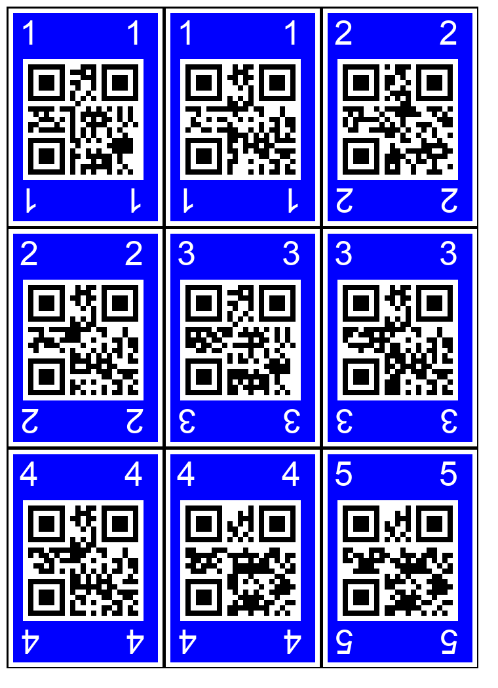
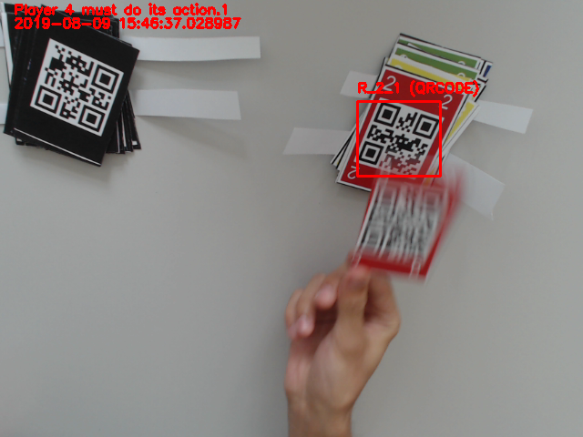
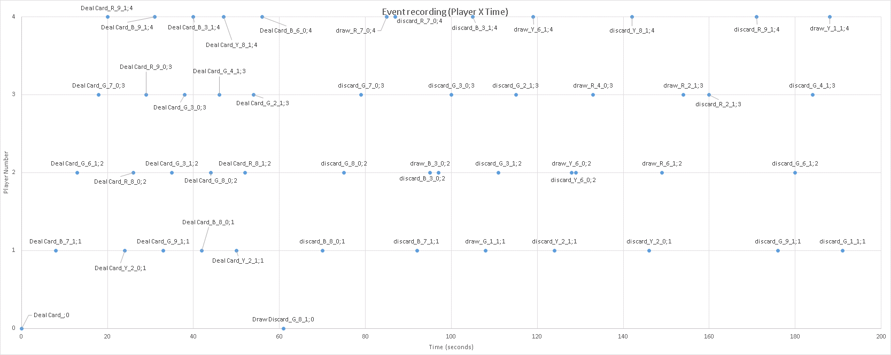

# iCubUno
This repository holds all the necessary scripts involved on the iCubUno project.

This project intends to teach an iCub robot on how to play the UNO card game with different humans. 
More information about the project can be found in our recent position paper: https://arxiv.org/abs/1908.00744

# Generating the deck

The GenerateCardDeck.py script generates the printable PDF with all the cards. Each card has a colour, a number and an associated QR-Code. The QR-Code is printed on the front and on the back of the card, in order to be recognizable by a simple camera.

The scripts currently generates cards with for colours (red, blue, green and yellow) and with numbers from 0 to 10. 

# Logging the game 

The PlayGame.py script logs an entire game. It starts with the players drawing cards. The deck and discard pile must be positioned in front of a camera, in order to have the QR-code decoded:

Each player then can discard a card, or draw a card. The game ends when one of the players have 0 cards in the hand.
This scripts logs in a .csv file each action (draw/discard) with the time it happened, the cards each player has at hand when the action happened, and the cards in the discard pile.

The  [Time Log Example](Logexample/Example_Video1_EventsLog.csv) exhibits an example of the events of a recorded game.

# Dependencies

